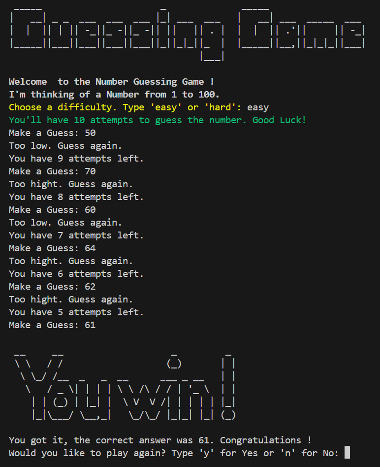

# Number Guessing Game

Welcome to the Number Guessing Game! 🎉

## Overview

This is a simple command-line game where you need to guess a number between 1 and 100. Depending on your choice of difficulty, you will have a limited number of attempts to find the correct number.

## How to Play

1. **Run the Game:** 
   - Double-click `Play_Guess_Game.bat` to start the game. This will open a command-line window and launch the game.

2. **Choose Difficulty:**
   - You'll be prompted to select a difficulty level. Type `'easy'` for 10 attempts or `'hard'` for 5 attempts.

3. **Make Guesses:**
   - Enter your guess when asked. The game will let you know if your guess is too high or too low.

4. **Winning or Losing:**
   - Guess the number correctly within your attempts to win. If you run out of guesses, the game will end, and you'll be notified of the correct number.

5. **Play Again:**
   - After the game ends, you can choose to play again or exit.

## Example of the Game

Here is an example of how the game appears when running:

## ASCII Art

The game features a cool ASCII art displayed. Check it out in the `images.py` file for more details!

## Running the Game

1. Ensure that you have Python installed on your system.
2. Place the `Play_Guess_Game.bat` and `logo.py` in the same folder.
3. Double-click `Play_Guess_Game.bat` to start the game.

## Contact

If you have any questions or feedback, please reach out!

Happy Guessing! 🎉
